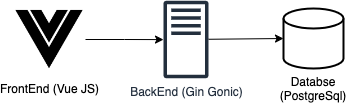

# foobar-tvs
## Story
The story can be found on [doc/Test.pdf](https://github.com/shuhanmirza/foobar-tvs/blob/main/doc/Test.pdf)

## Architecture
The architecture for implementing the story is pretty simple and straightforward.



### Frontend
I am using [VueJs](https://vuejs.org/) for implementing the front end because its learning curve is not that steep and does its job well. I used [Vuetify](https://vuetifyjs.com/en/) UI Library as it has Material design components.

### Backend
I choose [Gin Gonic](https://github.com/gin-gonic/gin) as it is one of the most performing API frameworks. I made use of [SQLC](https://github.com/kyleconroy/sqlc) for generating codes for interacting with the database. SQLC generates type-safe code from SQL which performs better than most of the available ORMs for Golang. Furthermore, I used  [golang-migrate cli](https://github.com/golang-migrate/migrate) for preparing migration SQL scripts.

### Database
I preferred PostgreSql as I find it approachable to interact with.
You can find the URL of the database design [here](https://dbdiagram.io/d/63613e8e5170fb6441dcf57f). I used [dbdiagram.io](https://dbdiagram.io) for designing the schema. The schema has two tables: (a) events, and (b) locations.


### Infrastructure
I made use of Docker and Docker-Compose for deploying all services.

## Getting Started

- Setup [Docker](https://docker.com) and Docker-Compose

- Create a mock docker network
```
docker network create mock-network
```

- Deploy Containers. It will spin up services as well as run the database migration scripts
```
docker-compose up --build
```

- Go to http://localhost:8080
- You can find the postman collection in the `doc` folder


## Note
This section will have the TODOs and acknowledgment.

### TODOs
- Revamp UI components according to the design
- write tests to get full test coverage

### Acknowledgment
-  stackoverflow.com, w3schools.com, google.com, youtube.com, github.com, dev.to, medium.com
- [Blog of Umesh Chaudhury](https://dev.to/umschaudhary/blog-with-go-gin-mysql-and-docker-part-2-3k8n)
